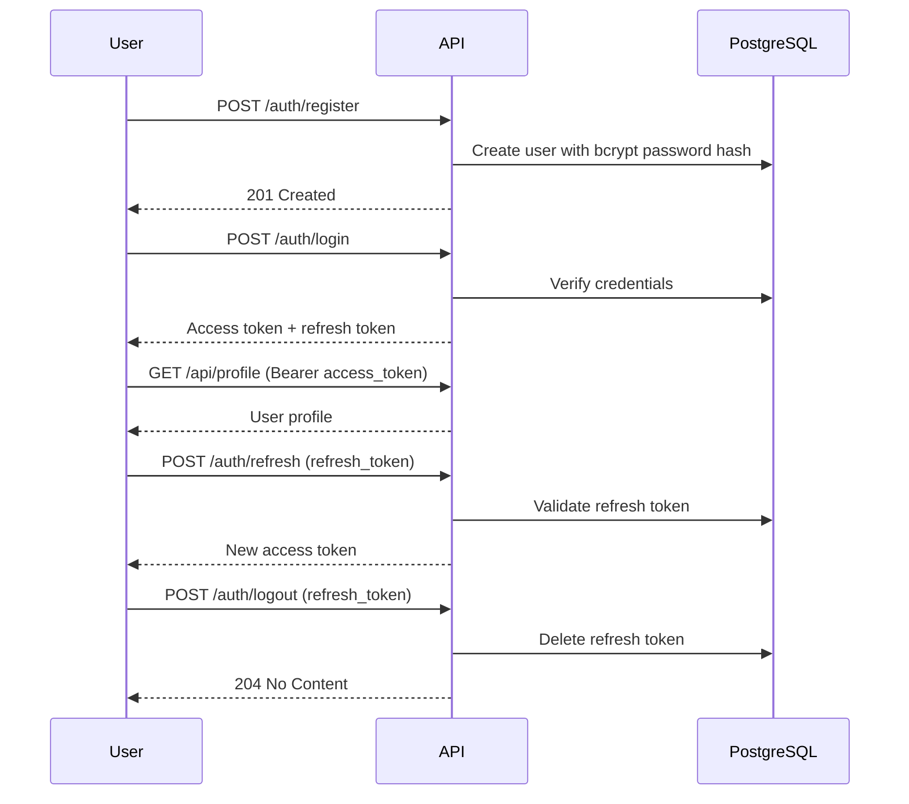

# JWT Authentication Service

A production-style JWT authentication API built with Spring Boot, PostgreSQL, RSA signing keys, and Docker.

This service supports:

- User registration with password validation and bcrypt hashing
- Login with short-lived RS256 access tokens
- Refresh-token based session renewal
- Stateless authentication for protected endpoints
- Public token verification endpoint
- Login rate limiting by IP (counts failed attempts only)
- Health endpoint for container health checks

## Table of Contents

- [JWT Authentication Service](#jwt-authentication-service)
  - [Table of Contents](#table-of-contents)
  - [1. Architecture Overview](#1-architecture-overview)
  - [2. Tech Stack](#2-tech-stack)
  - [3. Project Structure](#3-project-structure)
  - [4. Configuration](#4-configuration)
  - [5. How to Run](#5-how-to-run)
    - [Option A: Docker Compose (recommended)](#option-a-docker-compose-recommended)
    - [Option B: Run locally with Maven](#option-b-run-locally-with-maven)
  - [6. Authentication Flow](#6-authentication-flow)
  - [7. API Endpoints and cURL Commands](#7-api-endpoints-and-curl-commands)
    - [7.1 Health Check](#71-health-check)
    - [7.2 Register User](#72-register-user)
    - [7.3 Login](#73-login)
    - [7.4 Verify Token (Public)](#74-verify-token-public)
    - [7.5 Get Profile (Protected)](#75-get-profile-protected)
    - [7.6 Refresh Access Token](#76-refresh-access-token)
    - [7.7 Logout](#77-logout)
  - [8. Rate Limiting Behavior](#8-rate-limiting-behavior)
  - [9. Error Handling](#9-error-handling)
  - [10. Useful Test Script](#10-useful-test-script)

## 1. Architecture Overview

```mermaid
flowchart TD
    Client[Client App / cURL] -->|Register/Login/Refresh/Logout| API[Spring Boot API]
    Client -->|Bearer Token| Protected[/api/profile]
    Client -->|Token as query param| Verify[/api/verify-token]

    API --> AuthController[AuthController]
    API --> HealthController[HealthController]
    API --> VerifyController[TokenVerificationController]
    API --> ProfileController[ProfileController]

    AuthController --> AuthService[AuthService]
    ProfileController --> UserRepo[UserRepository]
    VerifyController --> JwtService[JwtService]
    AuthService --> JwtService
    AuthService --> RefreshRepo[RefreshTokenRepository]
    AuthService --> UserRepo

    JwtService --> Keys[RSA Key Pair\nprivate.pem/public.pem]
    UserRepo --> DB[(PostgreSQL)]
    RefreshRepo --> DB

    API --> Security[Security Filter Chain]
    Security --> RateLimiter[RateLimitingFilter]
    Security --> JwtFilter[JwtAuthenticationFilter]
```

## 2. Tech Stack

- Java 21
- Spring Boot
- Spring Security (stateless JWT)
- Spring Data JPA
- PostgreSQL
- Bucket4j (rate limiting)
- JJWT (RS256 JWT handling)
- Docker and Docker Compose

## 3. Project Structure

- src/main/java/com/gpp/jwt_authentication_service/controller: REST controllers
- src/main/java/com/gpp/jwt_authentication_service/service: Business and JWT logic
- src/main/java/com/gpp/jwt_authentication_service/security: Security filters and user details
- src/main/java/com/gpp/jwt_authentication_service/model: JPA entities
- src/main/java/com/gpp/jwt_authentication_service/repository: Spring Data repositories
- src/main/resources/application.properties: Environment-backed configuration
- docker-compose.yml: App + PostgreSQL services
- generate-keys.sh: RSA key generation helper
- test-auth-flow.sh: End-to-end authentication flow smoke test

## 4. Configuration

Copy .env.example to .env and adjust values as needed.

Required environment variables:

- API_PORT
- DATABASE_URL
- DB_USER
- DB_PASSWORD
- DB_NAME
- JWT_PRIVATE_KEY_PATH
- JWT_PUBLIC_KEY_PATH

Example:

```env
API_PORT=8080
DATABASE_URL=jdbc:postgresql://db:5432/jwt_auth_service
DB_USER=postuser
DB_PASSWORD=postpass
DB_NAME=jwt_auth_service
JWT_PRIVATE_KEY_PATH=./keys/private.pem
JWT_PUBLIC_KEY_PATH=./keys/public.pem
```

## 5. How to Run

### Option A: Docker Compose (recommended)

1. Create RSA keys (if not already present):

```bash
chmod +x generate-keys.sh
./generate-keys.sh
```

2. Start services:

```bash
docker compose up --build
```

3. Check health:

```bash
curl -s http://localhost:8080/api/health
```

Expected response:

```json
{ "status": "UP" }
```

### Option B: Run locally with Maven

Prerequisites:

- Java 21
- PostgreSQL running and reachable
- .env values exported into your environment

Compile:

```bash
./mvnw -DskipTests compile
```

Run:

```bash
./mvnw spring-boot:run
```

## 6. Authentication Flow



## 7. API Endpoints and cURL Commands

Base URL:

```text
http://localhost:8080
```

### 7.1 Health Check

Endpoint:

- Method: GET
- Path: /api/health
- Auth: Public
- Purpose: Liveness/health probe (used by Docker healthcheck)

Command:

```bash
curl -i http://localhost:8080/api/health
```

Expected: 200 OK with JSON status.

---

### 7.2 Register User

Endpoint:

- Method: POST
- Path: /auth/register
- Auth: Public
- Purpose: Create a user account

Validation rules:

- username: required
- email: required, valid email
- password: minimum 8 chars, must include at least one number and one special character

Command:

```bash
curl -i -X POST http://localhost:8080/auth/register \
  -H "Content-Type: application/json" \
  -d '{
    "username": "alice",
    "email": "alice@example.com",
    "password": "Password1!"
  }'
```

Expected:

- 201 Created on success
- 409 Conflict if username/email already exists
- 400 Bad Request for invalid payload

---

### 7.3 Login

Endpoint:

- Method: POST
- Path: /auth/login
- Auth: Public
- Purpose: Authenticate and receive access + refresh tokens

Command:

```bash
curl -i -X POST http://localhost:8080/auth/login \
  -H "Content-Type: application/json" \
  -d '{
    "username": "alice",
    "password": "Password1!"
  }'
```

Expected response fields:

- token_type (Bearer)
- access_token
- expires_in (seconds)
- refresh_token

Notes:

- Access token is RS256 signed.
- Roles claim value is user.
- Failed login attempts are rate-limited by IP.

---

### 7.4 Verify Token (Public)

Endpoint:

- Method: GET
- Path: /api/verify-token
- Auth: Public
- Purpose: Validate JWT and inspect claims

Command:

```bash
curl -i -G http://localhost:8080/api/verify-token \
  --data-urlencode "token=YOUR_ACCESS_TOKEN"
```

Expected:

- 200 OK with valid true and claims for valid token
- 200 OK with valid false and reason for expired/invalid token

---

### 7.5 Get Profile (Protected)

Endpoint:

- Method: GET
- Path: /api/profile
- Auth: Bearer access token required
- Purpose: Return authenticated user profile

Command:

```bash
curl -i http://localhost:8080/api/profile \
  -H "Authorization: Bearer YOUR_ACCESS_TOKEN"
```

Expected:

- 200 OK with id, username, email, roles
- 401 Unauthorized for missing, expired, or invalid token

---

### 7.6 Refresh Access Token

Endpoint:

- Method: POST
- Path: /auth/refresh
- Auth: Public (refresh token in body)
- Purpose: Generate a new access token from a valid refresh token

Command:

```bash
curl -i -X POST http://localhost:8080/auth/refresh \
  -H "Content-Type: application/json" \
  -d '{
    "refresh_token": "YOUR_REFRESH_TOKEN"
  }'
```

Expected:

- 200 OK with new access_token and expires_in
- 401 Unauthorized for invalid/expired refresh token

---

### 7.7 Logout

Endpoint:

- Method: POST
- Path: /auth/logout
- Auth: Public (refresh token in body)
- Purpose: Invalidate refresh token by deleting it from DB

Command:

```bash
curl -i -X POST http://localhost:8080/auth/logout \
  -H "Content-Type: application/json" \
  -d '{
    "refresh_token": "YOUR_REFRESH_TOKEN"
  }'
```

Expected:

- 204 No Content

After logout, using the same refresh token with /auth/refresh should return 401.

## 8. Rate Limiting Behavior

Applied to:

- POST /auth/login

Rules:

- Limit: 5 failed login attempts per minute per IP
- Successful logins do not consume rate-limit tokens

Headers you may see:

- X-RateLimit-Limit
- X-RateLimit-Remaining
- Retry-After (when blocked)

Blocked response:

- HTTP 429 Too Many Requests

## 9. Error Handling

Common patterns:

- 400 invalid_input for validation errors
- 401 unauthorized for bad credentials / invalid refresh token
- 401 token_expired for expired access token
- 401 invalid_token for malformed/signature-invalid access token
- 409 conflict for duplicate registration
- 500 internal_server_error for unexpected failures

## 10. Useful Test Script

Run the full authentication flow smoke test:

```bash
chmod +x test-auth-flow.sh
./test-auth-flow.sh
```

The script automatically tests:

1. Register
2. Login
3. Verify token
4. Access profile
5. Refresh token
6. Access profile with new token
7. Logout
8. Verify refresh token is invalid after logout
